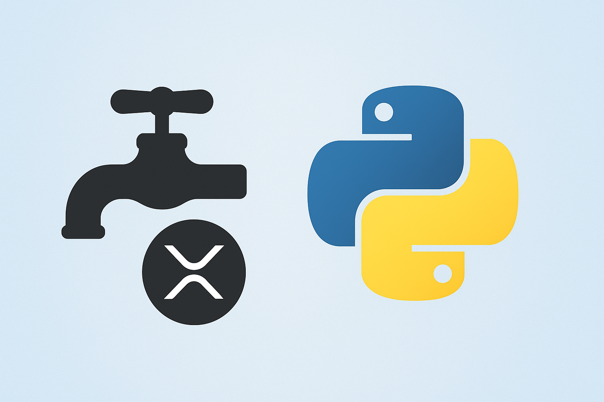

# FaucetEarner XRP Tools 🪙🐍


A set of Python scripts to **automate account creation** and **XRP faucet claiming** on [FaucetEarner](https://faucetearner.org).

This project includes:
- **`faucetearner_register.py`** → Automates account creation (manual or bulk via CSV).
- **`miner.py`** → Logs in and automatically claims XRP from the faucet at regular intervals.

---

## 📌 Features

- 🔑 Register new accounts (manual input or CSV file).
- 💾 Save account credentials securely into both **CSV** and **JSON**.
- 🟢 Automatic login with your credentials.
- ⛲ Auto-claim XRP faucet rewards.
- ⏳ Handles cooldown periods automatically.
- 🎨 Colored terminal output (via `colorama`).

---

## ⚙️ Installation

Clone this repository and install dependencies:

```bash
git clone https://github.com/meowdied/faucetearner-xrp.git
cd faucetearner-xrp
pip install -r requirements.txt
```

Requirements are listed in [`requirements.txt`](requirements.txt):

```
requests==2.31.0
beautifulsoup4==4.12.2
colorama==0.4.6
```

---

## 🚀 Usage

### 1. Account Registration
Run the registration script:

```bash
python faucetearner_register.py
```

Choose between:
- `1` → Manual registration (enter username/email/password interactively).
- `2` → Bulk registration using a CSV file with headers:  
  `username,email,password`

Created accounts are saved into:
- `successful_accounts.csv`
- `successful_accounts.json`

---

### 2. Faucet Miner
Run the miner script:

```bash
python miner.py
```

- Enter your **username/email** and **password**.
- Script will log in and claim XRP rewards.
- Waits **1 minute between claims** (or respects cooldown).

---

## 📂 Project Structure

```
├── faucetearner_register.py   # Account registration automation
├── miner.py                   # Faucet auto-claimer
├── requirements.txt           # Dependencies
└── successful_accounts.*      # Output files (generated after running)
```

---

## 🖼️ Banner



---

## ⚠️ Disclaimer

This project is for **educational purposes only**.  
Use responsibly and at your own risk. The author is not responsible for any misuse or account bans.

---

## 📜 License

This project is licensed under the MIT License.
